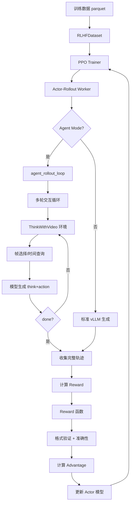
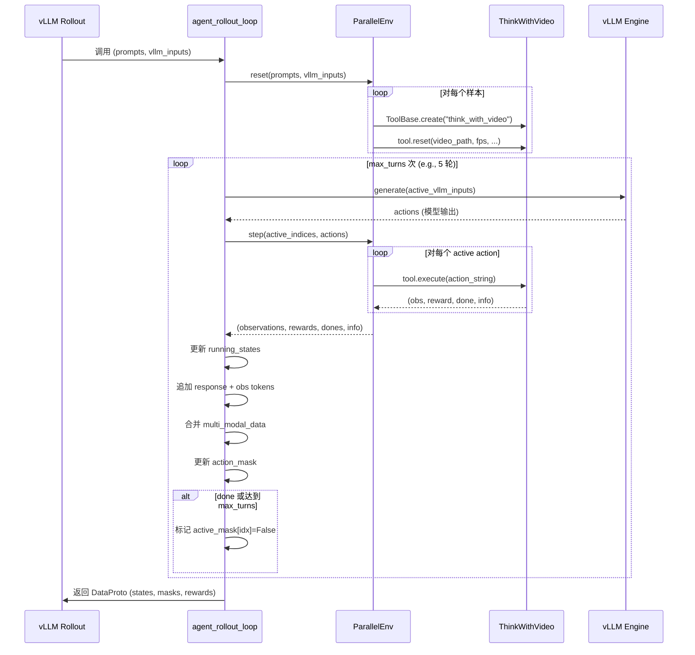
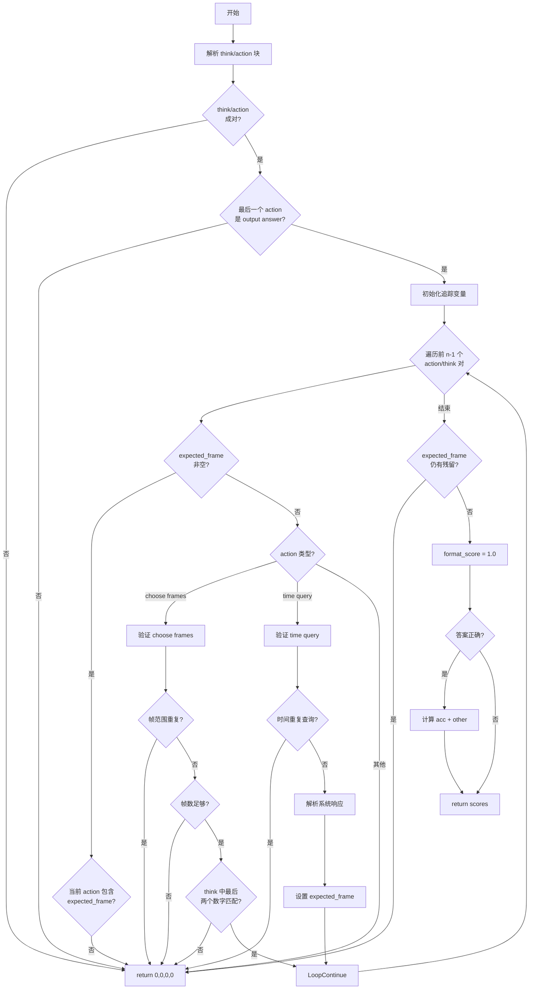

# FrameThinker 核心实现详解

> 本文档详细讲解 FrameThinker 的核心代码实现，包括 prompt 系统、agent 环境、reward 函数、训练流程等。
>
> **目标**：让你清楚知道每个组件的实现位置，以及如何修改和扩展。

---

## 目录

1. [系统架构总览](#section-1-系统架构总览)
2. [Prompt 系统详解](#section-2-prompt-系统详解)
3. [Agent 环境实现](#section-3-agent-环境实现)
4. [多轮交互机制](#section-4-多轮交互机制)
5. [Reward 函数详解](#section-5-reward-函数详解)
6. [数据流与训练集成](#section-6-数据流与训练集成)
7. [修改扩展指南](#section-7-修改扩展指南)

---

## Section 1: 系统架构总览

### 1.1 整体数据流程

FrameThinker 是一个基于 **verl (VolcEngine RL library)** 的视频推理系统，使用 PPO/GRPO 算法进行强化学习训练。核心思想是让模型通过多轮迭代主动选择视频帧来回答问题，而不是一次性处理所有帧。



### 1.2 核心组件

| 组件 | 文件路径 | 作用 |
|------|---------|------|
| **System Prompt** | `examples/agent/SFT.json` | 定义模型的行为和输出格式 |
| **Agent 环境** | `verl/workers/agent/envs/visual_agent/think_with_video.py` | ThinkWithVideo 工具类，处理帧选择和时间查询 |
| **并发管理** | `verl/workers/agent/parallel_env.py` | ParallelEnv 类，管理多个agent并发执行 |
| **多轮循环** | `verl/workers/agent/parallel_env.py` | agent_rollout_loop 函数，实现迭代交互 |
| **Reward 函数** | `verl/utils/reward_score/think_with_video_reward.py` | 计算格式、准确性、额外奖励 |
| **数据加载** | `verl/utils/dataset/rl_dataset.py` | RLHFDataset 类，加载训练数据 |
| **Rollout Worker** | `verl/workers/rollout/vllm_rollout/vllm_rollout_spmd.py` | vLLM 推理引擎集成 |
| **PPO Trainer** | `verl/trainer/ppo/ray_trainer.py` | 主训练循环 |
| **配置文件** | `verl/trainer/config/ppo_trainer.yaml` | 训练超参数和 agent 配置 |

### 1.3 与 verl 的集成方式

FrameThinker 扩展了 verl 的标准 RLHF 训练流程，添加了 **agent mode**：

**关键配置**（在 `train_frame_thinker.sh:44` 和 `ppo_trainer.yaml:92-101`）：

```bash
# train_frame_thinker.sh (部分)
actor_rollout_ref.rollout.agent.activate_agent=True \
actor_rollout_ref.rollout.agent.tool_name_key=env_name \
actor_rollout_ref.rollout.agent.single_response_max_tokens=8192 \
actor_rollout_ref.rollout.agent.max_turns=5 \
actor_rollout_ref.rollout.agent.max_vllm_images=128 \
```

**agent mode 启用条件**（`vllm_rollout_spmd.py:279`）：

```python
if self.config.agent.activate_agent:
    agent_proto = agent_rollout_loop(
        config=self.config,
        vllm_engine=self.inference_engine,
        vllm_inputs=vllm_inputs,
        prompts=prompts,
        multi_modal_inputs=non_tensor_batch.get("multi_modal_inputs", None),
        sampling_params=self.sampling_params
    )
```

当 `activate_agent=True` 时，vLLM rollout 会调用 `agent_rollout_loop` 而不是标准生成流程。

---

## Section 2: Prompt 系统详解

### 2.1 System Prompt 定义

**文件位置**：`examples/agent/SFT.json`

System prompt 定义了模型的行为模式和输出格式。这是 FrameThinker 的核心"指令集"。

**完整 System Prompt**（从 SFT.json 提取）：

```text
You are an expert AI assistant that answers questions about a video by iteratively analyzing it.
Your task is to output your reasoning within a <think> </think> tag, followed by a specific action within an <action> </action> tag.
Possible actions are:
1. `choose frames between START_FRAME and END_FRAME`: Request a more detailed view of a specific video segment. The number of frames is fixed, currently 8.
2. `get frame number at time MM:SS`: Get the exact frame number for a specific time. Convert hours to minutes if needed (e.g., for 1 hour, 2 minutes, and 30 seconds, use 62:30).
3. `output answer: OPTION`: Provide the final answer (e.g., A, B, C...) when you are confident.
```

### 2.2 输出格式要求

模型的每次输出必须遵循以下结构：

```xml
<think>
  [模型的推理过程，可以是任意文本]
  [最后两个数字必须是下一步要选择的帧范围]
</think>
<action>
  [三种 action 之一]
</action>
```

**关键点**：
1. `<think>` 和 `<action>` 必须成对出现
2. `<think>` 中的推理是自由形式的，但如果下一步是 `choose frames`，则必须在思考的最后提到要选择的帧号
3. `<action>` 只能包含三种预定义的 action 格式之一

### 2.3 三种 Action 类型详解

#### Action 1: 选择帧范围

**格式**：`choose frames between START_FRAME and END_FRAME`

**示例**（来自 SFT.json 第1个样本）：

```xml
<think>The user wants to know what the boy is doing in relation to the chickens. Looking at the provided frames, from frame 0 to frame 1540, the boy is consistently standing still and looking at the chickens through a glass pane. His body is oriented towards the chickens, and his gaze is directed at them. This action is clearly "watching". Option A directly corresponds to this observation. The other options are incorrect: he is not lying down (B), running after them (C), or running to them (D). While he might be excited (E), the most direct and undeniable action depicted across all frames is watching. The initial frames provide enough clear evidence to confidently select the answer without further analysis of the video.</think>
<action>output answer: A</action>
```

**典型使用场景**：当初始帧不足以回答问题时，模型需要放大某个时间段。

```xml
<think>I need to see what happens between frames 500 and 1000 to understand the action. Let me request frames 500 and 1000.</think>
<action>choose frames between 500 and 1000</action>
```

**处理逻辑**（在 `think_with_video.py:52-68`）：

```python
# verl/workers/agent/envs/visual_agent/think_with_video.py:52
match = re.search(r"choose frames between (\d+) and (\d+)", action_block)
if not match:
    return '', 0.0, True, {}
start_frame = int(match.group(1))
end_frame = int(match.group(2))

# 边界检查
if start_frame > self.total_frames:
    return '', 0.0, True, {}
if end_frame > self.total_frames:
    end_frame = self.total_frames

# 确保帧数足够
if start_frame >= end_frame - self.num_frames_per_sample:
    return '', 0.0, True, {}
```

#### Action 2: 查询时间对应的帧号

**格式**：`get frame number at time MM:SS`

**示例**：

```xml
<think>The question mentions "at 1:30", I need to know which frame corresponds to that time.</think>
<action>get frame number at time 1:30</action>
```

**处理逻辑**（在 `think_with_video.py:42-51`）：

```python
# verl/workers/agent/envs/visual_agent/think_with_video.py:42
time_match = re.match(r'get frame number at time\s+(\S+)', action_block.strip())
if time_match:
    time_str = time_match.group(1)
    try:
        minutes, seconds = map(int, time_str.split(':'))
        total_seconds = minutes * 60 + seconds
        frame_number = int(total_seconds * self.fps)
        message = f"Frame number at time {time_str} is: {frame_number}."
        all_user_msg = self.chat_template.format(message)
        return all_user_msg, 0.0, False, {}
    except (ValueError, IndexError):
        return '', 0.0, True, {}
```

**系统返回格式**（会被添加到对话历史）：

```
<|im_end|>
<|im_start|>user
Frame number at time 1:30 is: 2700.<|im_end|>
<|im_start|>assistant
```

模型在下一轮可以使用这个帧号来 `choose frames`。

#### Action 3: 输出最终答案

**格式**：`output answer: OPTION`

**示例**（来自 SFT.json）：

```xml
<think>Based on my analysis, option B is correct.</think>
<action>output answer: B</action>
```

**终止条件**：一旦模型输出 `output answer:`，交互立即结束（`done=True`）。

### 2.4 SFT 数据格式

**文件结构**（`examples/agent/SFT.json`）：

```json
[
    {
        "messages": [
            {"role": "user", "content": "问题 + 初始帧"},
            {"role": "assistant", "content": "<think>...</think><action>...</action>"}
        ],
        "images": ["frame_0.jpg", "frame_159.jpg", ...],
        "system": "System prompt 文本"
    },
    ...
]
```

**关键字段**：
- `messages`: OpenAI 格式的对话历史
- `images`: 帧图像的文件路径列表
- `system`: 固定的 system prompt（所有样本相同）

**初始输入格式**（user 消息）：

```
[问题文本]
A: [选项A]
B: [选项B]
...

frame 0: <image>
frame 159: <image>
frame 318: <image>
...
```

每个 `<image>` token 会被替换为实际的图像。

### 2.5 多轮样本示例（未在 SFT.json 中）

虽然 SFT.json 中的样本都是单轮（直接输出答案），但系统支持多轮交互。多轮样本格式示例：

```json
{
    "messages": [
        {"role": "user", "content": "问题 + frame 0-1000"},
        {"role": "assistant", "content": "<think>需要更多信息</think><action>choose frames between 500 and 700</action>"},
        {"role": "user", "content": "frame 500: <image>\nframe 550: <image>\n..."},
        {"role": "assistant", "content": "<think>现在可以回答了</think><action>output answer: B</action>"}
    ],
    "images": ["初始8帧 + 后续8帧"],
    "system": "..."
}
```

---

## Section 3: Agent 环境实现

### 3.1 ThinkWithVideo 工具类概览

**文件位置**：`verl/workers/agent/envs/visual_agent/think_with_video.py`

`ThinkWithVideo` 是 `ToolBase` 的子类，实现了视频帧选择和时间查询功能。它遵循 OpenAI Gym 的接口设计。

**类的核心属性**（`__init__` 方法，第 25-38 行）：

```python
class ThinkWithVideo(ToolBase):
    name = "think_with_video"
    action_start = '<action>'
    action_end = '</action>'
    chat_template = """<|im_end|>
        <|im_start|>user
        {}<|im_end|>
        <|im_start|>assistant
        """

    def __init__(self, _name, _desc, _params, **kwargs):
        self.chatml_history = []
        self.multi_modal_data = None
        self.video_path = None
        self.fps = None
        self.total_frames = None
        self.vr = None  # decord.VideoReader

        self.num_frames_per_sample = None  # 8 或 12
        self.max_width = None    # 640 或 448
        self.max_height = None   # 360 或 252
```

### 3.2 reset() 方法：初始化环境

**作用**：每个新的视频任务开始时调用，设置视频元信息和采样参数。

**完整代码**（第 81-106 行）：

```python
def reset(self, raw_prompt, multi_modal_data, origin_multi_modal_data, **kwargs):
    self.video_path = kwargs.get('video_path')
    self.fps = kwargs.get('fps')
    self.total_frames = kwargs.get('total_frames')
    self.height = kwargs.get('height')
    self.width = kwargs.get('width')
    self.vr = None
    self.chatml_history = raw_prompt
    self.multi_modal_data = origin_multi_modal_data

    # 根据视频时长选择采样策略
    if self.total_frames and self.fps:
        duration_seconds = self.total_frames / self.fps
        if duration_seconds > 300:  # 5分钟
            self.num_frames_per_sample = 12
            self.max_width = 448
            self.max_height = 252
        else:
            self.num_frames_per_sample = 8
            self.max_width = 640
            self.max_height = 360
    else:
        self.num_frames_per_sample = 8
        self.max_width = 640
        self.max_height = 360

    assert 'image' in self.multi_modal_data.keys()
    assert len(self.multi_modal_data['image']) > 0
    self.height = self.multi_modal_data['image'][0].height
    self.width = self.multi_modal_data['image'][0].width
```

**关键策略**：
- **短视频**（≤5分钟）：每次采样 **8 帧**，分辨率 **640x360**
- **长视频**（>5分钟）：每次采样 **12 帧**，分辨率 **448x252**

这是为了平衡信息量和计算成本。

### 3.3 execute() 方法：执行 Action

**作用**：解析模型的 `<action>` 输出，执行相应操作，返回 observation/reward/done。

**返回值格式**：

```python
return observation, reward, done, info
```

- `observation`: 字符串或字典，包含新帧的描述/图像
- `reward`: float，当前步骤的即时奖励（FrameThinker 中总是 0.0，最终 reward 在训练循环中计算）
- `done`: boolean，是否结束交互
- `info`: 额外信息（未使用）

**主流程**（第 40-80 行）：

```python
def execute(self, action_string, **kwargs):
    if not self.video_path:
        return '', 0.0, True, {}

    # 提取 <action>...</action> 的内容
    action_block = extract_tool_call_contents(self.action_start, self.action_end, action_string)
    if not action_block:
        return '', 0.0, True, {}
    action_block = action_block[-1]  # 取最后一个 action

    # 处理时间查询
    time_match = re.match(r'get frame number at time\s+(\S+)', action_block.strip())
    if time_match:
        time_str = time_match.group(1)
        try:
            minutes, seconds = map(int, time_str.split(':'))
            total_seconds = minutes * 60 + seconds
            frame_number = int(total_seconds * self.fps)
            message = f"Frame number at time {time_str} is: {frame_number}."
            all_user_msg = self.chat_template.format(message)
            return all_user_msg, 0.0, False, {}  # done=False，继续交互
        except (ValueError, IndexError):
            return '', 0.0, True, {}  # 解析失败，终止

    # 处理帧选择
    match = re.search(r"choose frames between (\d+) and (\d+)", action_block)
    if not match:
        return '', 0.0, True, {}  # 格式错误，终止

    start_frame = int(match.group(1))
    end_frame = int(match.group(2))

    # 边界和合法性检查
    if start_frame > self.total_frames:
        return '', 0.0, True, {}
    if end_frame > self.total_frames:
        end_frame = self.total_frames
    if start_frame >= end_frame - self.num_frames_per_sample:
        return '', 0.0, True, {}

    # 提取帧
    user_msg, focused_images_data = self._process_zoom_request_no_desc(
        start_frame=start_frame,
        end_frame=end_frame
    )
    all_user_msg = self.chat_template.format(user_msg)

    if len(focused_images_data) == 0:
        return '', 0.0, True, {}

    # 返回字典格式的 observation
    obs_dict = {
        "prompt": all_user_msg,
        "multi_modal_data": {
            "image": focused_images_data
        }
    }
    return obs_dict, 0.0, False, {}
```

### 3.4 _process_zoom_request_no_desc()：帧提取核心逻辑

**作用**：从视频中提取指定范围内的帧，返回 prompt 和图像列表。

**完整代码**（第 108-155 行）：

```python
def _process_zoom_request_no_desc(
        self,
        start_frame: int,
        end_frame: int
) -> Tuple[str, List[np.ndarray]]:
    sample_start = start_frame + 1
    sample_end = end_frame - 1

    try:
        # 懒加载 VideoReader
        if self.vr is None:
            max_retries = 3
            base_delay = 2
            for attempt in range(max_retries):
                try:
                    target_w, target_h = self._calculate_target_dims()
                    self.vr = decord.VideoReader(
                        self.video_path,
                        ctx=decord.cpu(0),
                        width=target_w,
                        height=target_h
                    )
                    break
                except Exception as e:
                    if "Resource temporarily unavailable" in str(e) and attempt < max_retries - 1:
                        wait_time = (base_delay * (2 ** attempt)) + random.uniform(0, 1)
                        print(f"WARN: Retrying in {wait_time:.2f} seconds...")
                        time.sleep(wait_time)
                    else:
                        raise e

        # 等间隔采样
        frame_indices = sorted(
            list(set(map(int, np.linspace(sample_start, sample_end, self.num_frames_per_sample))))
        )

        # 批量读取帧
        focused_frames_array = self.vr.get_batch(frame_indices).asnumpy()
        assert len(frame_indices) > 0

    except Exception as e:
        print(f"[ERROR] Failed to process video '{self.video_path}' between frames {start_frame}-{end_frame}.")
        return "", []

    # 构造 prompt
    prompt_parts = []
    for frame_idx in frame_indices:
        prompt_parts.append(f"frame {frame_idx}: <image>")

    focused_prompt_segment = "\n".join(prompt_parts)
    focused_images_data = [Image.fromarray(frame) for frame in focused_frames_array]
    assert len(focused_images_data) > 0

    return focused_prompt_segment, focused_images_data
```

**关键点**：
1. **懒加载**：`VideoReader` 在第一次需要时才创建（避免初始化时加载所有视频）
2. **重试机制**：处理资源占用问题，指数退避重试
3. **等间隔采样**：使用 `np.linspace` 在 `[sample_start, sample_end]` 范围内均匀采样
4. **批量读取**：`get_batch()` 一次性读取多帧，效率更高

### 3.5 _calculate_target_dims()：计算目标分辨率

**作用**：根据原始视频尺寸和最大限制，计算保持宽高比的目标分辨率。

**代码**（第 157-170 行）：

```python
def _calculate_target_dims(self) -> tuple[int, int]:
    w, h = self.width, self.height

    if w <= self.max_width and h <= self.max_height:
        return w, h

    ratio_w = self.max_width / w
    ratio_h = self.max_height / h
    scale_ratio = min(ratio_w, ratio_h)

    new_w = int(w * scale_ratio)
    new_h = int(h * scale_ratio)

    return new_w, new_h
```

**示例**：
- 原始：1920x1080，最大：640x360
- `ratio_w = 640/1920 = 0.333`，`ratio_h = 360/1080 = 0.333`
- `scale_ratio = 0.333`
- 结果：640x360

### 3.6 工具注册机制

**ToolBase 元类**（`tool_envs.py:21-33`）：

```python
class ToolMeta(type):
    def __init__(cls, name, bases, attrs):
        super().__init__(name, bases, attrs)
        if name == 'ToolBase':
            return

        if not hasattr(cls, 'name'):
            raise AttributeError(f"Tool subclass {name} must define a 'name' attribute.")

        if cls.name in ToolBase.registry:
            existing = ToolBase.registry[cls.name]
            print(f"WARNING: {cls.__name__} overwriting '{cls.name}'")
            return

        ToolBase.registry[cls.name] = cls
```

**工具创建**（`tool_envs.py:40-48`）：

```python
@classmethod
def create(cls, name, description='', parameters=[], **kwargs):
    tool_cls = cls.registry.get(name, None)
    if not tool_cls:
        raise ValueError(f"No tool registered with name '{name}'")
    return tool_cls(name, description, parameters, **kwargs)
```

**使用方式**（在 `parallel_env.py:400` 中）：

```python
tool_fns = ToolBase.create(tool_name)  # tool_name = "think_with_video"
```

由于 `ThinkWithVideo` 定义了 `name = "think_with_video"`，它会自动注册到 `ToolBase.registry`。

---

## Section 4: 多轮交互机制

### 4.1 整体流程图



### 4.2 agent_rollout_loop 函数：多轮循环核心

**文件位置**：`verl/workers/agent/parallel_env.py:73-242`

这是整个 agent 系统的"心脏"，负责协调模型生成和环境交互。

**函数签名**（第 73 行）：

```python
def agent_rollout_loop(config, vllm_engine, vllm_inputs, prompts, multi_modal_inputs, sampling_params):
```

**输入参数**：
- `config`: 配置对象，包含 `agent.max_turns`、`response_length` 等
- `vllm_engine`: vLLM 推理引擎
- `vllm_inputs`: 初始输入列表（每个样本一个 dict）
- `prompts`: DataProto，包含 `input_ids`、`attention_mask`等
- `multi_modal_inputs`: 多模态数据（图像/视频）
- `sampling_params`: 采样参数

**返回值**：
- `DataProto`：包含 `response`、`action_mask`、`env_reward`、`tool_cnt` 等

#### 4.2.1 初始化阶段

**代码**（第 80-130 行，节选）：

```python
# 设置 agent 专用的采样参数
agent_sampling_params = sampling_params.clone()
agent_sampling_params.detokenize = True
agent_sampling_params.skip_special_tokens = False
agent_sampling_params.spaces_between_special_tokens = False
agent_sampling_params.n = 1  # agent mode 强制 n=1
agent_sampling_params.include_stop_str_in_output = True
max_generated_tokens = min(config.agent.single_response_max_tokens, config.response_length)
agent_sampling_params.max_tokens = max_generated_tokens

# 支持自定义 stop token
custom_stop = list(config.agent.custom_stop)
if custom_stop:
    prev_stop = sampling_params.stop if sampling_params.stop else []
    agent_sampling_params.stop = prev_stop + custom_stop

tokenizer = hf_tokenizer(config.agent.vl_model_path)
processor = hf_processor(config.agent.vl_model_path)

# 初始化变量
batch_size = len(vllm_inputs)
vllm_input_list = []
running_states = []  # 累积的 token ids
running_action_masks = []  # 1=action, 0=observation
running_attn_masks = []  # 1=有效 token, 0=padding
reward_tensor_list = []
active_mask = []  # 是否仍在交互
mm_input_list = []  # 多模态数据
tool_call_cnt_list = []  # 工具调用次数

# 创建环境
env = ParallelEnv(config.agent, tokenizer, processor)
env.reset(prompts, vllm_inputs, n=sampling_params.n)

# Interleaving inputs if sampling_params.n > 1
for i in range(batch_size):
    for _ in range(sampling_params.n):
        vllm_input_list.append(deepcopy(vllm_inputs[i]))
        prompt_ids = prompts.batch['input_ids'][i, :].clone()
        running_states.append(prompt_ids)
        prompt_mask = prompts.batch['attention_mask'][i, :].clone()
        running_action_masks.append(prompt_mask)  # 初始全为 1（prompt 视为 action）
        running_attn_masks.append(prompt_mask)
        reward_tensor = torch.zeros_like(prompt_ids, dtype=torch.float)
        reward_tensor_list.append(reward_tensor)
        active_mask.append(True)  # 初始都是 active
        mm_input_list.append(deepcopy(multi_modal_inputs[i]))
        tool_call_cnt_list.append(0)
```

**关键点**：
1. **n=1 强制**：agent mode 不支持 n > 1 的并行采样（因为每个轨迹是独立的交互过程）
2. **running_states**：累积所有 token（prompt + response_1 + obs_1 + response_2 + ...）
3. **running_action_masks**：区分 action token（来自模型）和 observation token（来自环境）
   - `1` = action token（参与 policy gradient 更新）
   - `0` = observation token（不参与更新）
4. **active_mask**：跟踪哪些样本还在交互

#### 4.2.2 主循环：迭代生成和交互

**代码**（第 132-230 行，节选关键部分）：

```python
pg = vllm_ps.get_tp_group()
max_total_length = config.prompt_length + config.response_length

for step in range(config.agent.max_turns):
    print(f' [DEBUG] {step=}, num_active={sum(active_mask)}')
    if sum(active_mask) == 0:
        break

    # 1. 只对 active 样本生成
    active_indices = [idx for idx, is_active in enumerate(active_mask) if is_active]
    active_vllm_inputs = [vinput for vinput, is_active in zip(vllm_input_list, active_mask) if is_active]

    actions = vllm_engine.generate(
        prompts=active_vllm_inputs,
        sampling_params=agent_sampling_params,
        use_tqdm=False
    )

    # 2. 广播并执行 actions（在 rank 0 执行，然后广播结果）
    if pg.is_first_rank:
        obs_results = env.step(active_indices, actions)
    else:
        obs_results = None
    obs_results = pg.broadcast_object(obs_results)
    observations, rewards, dones, info = obs_results

    # 3. 处理每个 active 样本的结果
    for idx, obs, act, rew, done in zip(active_indices, observations, actions, rewards, dones):
        # 追加模型生成的 response token
        response_token_ids = torch.tensor(act.outputs[0].token_ids, dtype=torch.int64, device=running_states[idx].device)
        running_states[idx] = torch.cat([running_states[idx], response_token_ids])

        # 更新 vllm_input（用于下一轮生成）
        vllm_input_list[idx]['prompt_token_ids'] = _concat_vllm_input(
            vllm_input_list[idx]['prompt_token_ids'],
            response_token_ids,
            tokenizer=tokenizer,
        )

        # 追加 action reward（当前步骤为 0，最后一个 token 加上环境 reward）
        action_reward = torch.zeros_like(response_token_ids, dtype=torch.float)
        reward_tensor_list[idx] = torch.cat([reward_tensor_list[idx], action_reward])
        reward_tensor_list[idx][-1] += rew  # 环境奖励加到最后一个 action token

        # action_mask: response 部分全为 1
        action_mask = torch.ones_like(response_token_ids, dtype=torch.int64)
        running_action_masks[idx] = torch.cat([running_action_masks[idx], action_mask])
        running_attn_masks[idx] = torch.cat([running_attn_masks[idx], action_mask])

        # 检查长度限制
        if running_states[idx].shape[-1] >= max_total_length or len(vllm_input_list[idx]['prompt_token_ids']) >= max_total_length:
            active_mask[idx] = False
            continue

        # 检查是否终止
        if done or step == config.agent.max_turns - 1:
            active_mask[idx] = False
            continue

        tool_call_cnt_list[idx] += 1

        # 4. 追加 observation tokens 和 images
        if 'prompt_token_ids_vllm' in obs.keys() and 'prompt_token_ids_model' in obs.keys():
            obs_token_ids_vllm = obs['prompt_token_ids_vllm']
            obs_token_ids_model = obs['prompt_token_ids_model'].to(running_states[idx].device)

            # 再次检查长度
            if len(vllm_input_list[idx]['prompt_token_ids']) + len(obs_token_ids_vllm) >= max_total_length:
                active_mask[idx] = False
                continue

            # 追加 obs tokens 到 vllm_input（下一轮生成的输入）
            vllm_input_list[idx]['prompt_token_ids'] = _concat_vllm_input(
                vllm_input_list[idx]['prompt_token_ids'],
                obs_token_ids_vllm,
                tokenizer=tokenizer,
            )

            # 追加 obs tokens 到 running_states（用于训练的完整序列）
            running_states[idx] = torch.cat([running_states[idx], obs_token_ids_model])
            obs_reward = torch.zeros(len(obs_token_ids_model), dtype=torch.float)
            reward_tensor_list[idx] = torch.cat([reward_tensor_list[idx], obs_reward], dim=-1)

            # obs_mask: observation 部分全为 0（不参与 policy gradient）
            obs_mask = torch.zeros(len(obs_token_ids_model), dtype=torch.int64)
            running_action_masks[idx] = torch.cat([running_action_masks[idx], obs_mask])

            # attention_mask: observation 也需要 attend
            attn_mask = torch.ones(len(obs_token_ids_model), dtype=torch.int64)
            running_attn_masks[idx] = torch.cat([running_attn_masks[idx], attn_mask])

            # 合并多模态数据（新帧图像）
            mm_data = obs.get('multi_modal_data', {})
            if 'image' in mm_data.keys():
                if 'multi_modal_data' not in vllm_input_list[idx].keys():
                    vllm_input_list[idx]['multi_modal_data'] = {"image": []}
                vllm_input_list[idx]['multi_modal_data']['image'] += mm_data['image']

            mm_input = obs.get('multi_modal_inputs', {})
            if mm_input:
                mm_input_list[idx] = _merge_multi_modal_inputs(mm_input_list[idx], mm_input)

        # 最终长度检查
        if running_states[idx].shape[-1] >= max_total_length:
            active_mask[idx] = False
```

**核心逻辑**：
1. **生成**：vLLM 对当前 active 样本生成 response
2. **执行**：`env.step()` 解析 action 并执行，返回 observation
3. **追加 response**：
   - `running_states` += response_token_ids
   - `running_action_masks` += 全 1（action）
   - `reward_tensor_list` += 0（最后一个 token 加环境 reward）
4. **追加 observation**：
   - `running_states` += obs_token_ids
   - `running_action_masks` += 全 0（observation）
   - `reward_tensor_list` += 0
   - 合并新帧图像到 `vllm_input_list[idx]['multi_modal_data']`

#### 4.2.3 返回阶段：构造 DataProto

**代码**（第 232-257 行）：

```python
env.close()
target_device = prompts.batch['input_ids'].device

# Padding 到 max_total_length
running_states = [state[: max_total_length] for state in running_states]
state_tensor = pad_2d_list_to_length(running_states, tokenizer.pad_token_id, max_total_length).to(target_device)

running_action_masks = [mask[: max_total_length] for mask in running_action_masks]
action_mask_tensor = pad_2d_list_to_length(running_action_masks, 0, max_total_length).to(target_device)

running_attn_masks = [mask[: max_total_length] for mask in running_attn_masks]
attn_mask_tensor = pad_2d_list_to_length(running_attn_masks, 0, max_total_length).to(target_device)

# 计算 position_ids（Qwen2-VL 需要特殊处理）
if processor is not None and processor.image_processor.__class__.__name__ == "Qwen2VLImageProcessor":
    position_ids_list = [
        get_rope_index(
            processor,
            input_ids=state_tensor[i, :],
            image_grid_thw=mm_input_list[i].get("image_grid_thw", None),
            video_grid_thw=mm_input_list[i].get("video_grid_thw", None),
            attention_mask=attn_mask_tensor[i, :],
        ) for i in range(batch_size * sampling_params.n)
    ]
    position_ids_tensor = torch.stack(position_ids_list, dim=0)
else:
    position_ids_tensor = compute_position_id_with_mask(attn_mask_tensor)

reward_tensor_list = [reward[: max_total_length] for reward in reward_tensor_list]
reward_tensor = pad_2d_list_to_length(reward_tensor_list, 0.0, max_total_length).to(target_device)

tool_call_tensor = torch.tensor(tool_call_cnt_list, dtype=torch.float32).to(target_device).unsqueeze(1)

return DataProto.from_dict(
    tensors={
        "response": state_tensor[:, -config.response_length: ],  # 只取最后 response_length 部分
        "action_mask": action_mask_tensor,
        "attention_mask": attn_mask_tensor,
        "position_ids": position_ids_tensor,
        "env_reward": reward_tensor[:, -config.response_length: ],
        "tool_cnt": tool_call_tensor,
    },
    non_tensors={"multi_modal_inputs": mm_input_list} if processor is not None else None
)
```

**关键点**：
1. **response 截取**：只返回最后 `response_length` 的部分（前面的 prompt 已经在训练数据中）
2. **action_mask**：用于训练时区分哪些 token 是模型生成的（需要更新梯度）
3. **env_reward**：环境奖励（实际上是 0，真正的 reward 在训练循环中计算）
4. **tool_cnt**：每个样本的工具调用次数（用于 metrics）

### 4.3 ParallelEnv 类：并发环境管理

**文件位置**：`verl/workers/agent/parallel_env.py:259-444`

`ParallelEnv` 管理多个 agent 的并发执行，支持线程池加速工具调用。

#### 4.3.1 初始化和 reset

**代码**（第 265-272 行）：

```python
def __init__(self, env_config, tokenizer, processor, **kwargs):
    self.config = env_config
    self.tokenizer = tokenizer
    self.processor = processor
    self.tools = []  # 类型：List[ToolBase or None]
```

**reset 方法**（第 374-411 行）：

```python
def reset(self, prompts, vllm_inputs, n=1, **kwargs):
    self.tools = []
    reset_output_list = []
    num_agent, num_non_agent = 0, 0

    for i in range(len(prompts)):
        data_item = prompts[i]  # DataProtoItem
        tool_name = data_item.non_tensor_batch.pop(self.config.tool_name_key, '')  # 默认 'env_name'
        raw_prompt = data_item.non_tensor_batch.pop('raw_prompt', None)
        video_path = data_item.non_tensor_batch['video_path']
        fps = data_item.non_tensor_batch['fps']
        total_frames = data_item.non_tensor_batch['total_frames']
        vllm_input_item = vllm_inputs[i]
        multi_modal_data = vllm_input_item.get("multi_modal_data", None)
        origin_multi_modal_data = data_item.non_tensor_batch.pop("origin_multi_modal_data", None)

        for _ in range(n):
            if tool_name:
                # 创建 agent 工具
                tool_fns = ToolBase.create(tool_name)
                reset_output = tool_fns.reset(
                    raw_prompt=raw_prompt,
                    multi_modal_data=deepcopy(multi_modal_data),
                    origin_multi_modal_data=deepcopy(origin_multi_modal_data),
                    video_path=video_path,
                    fps=fps,
                    total_frames=total_frames,
                )
                self.tools.append(tool_fns)
                num_agent += 1
            else:
                # 非 agent 数据（标准 RLHF）
                self.tools.append(None)
                num_non_agent += 1

    print(f' [DEBUG agent] {num_agent=}, {num_non_agent=}')
    return reset_output_list
```

**关键点**：
- 通过 `tool_name_key`（默认 `env_name`）判断是否为 agent 数据
- agent 数据：创建 `ThinkWithVideo` 工具并 reset
- 非 agent 数据：`self.tools[i] = None`（用于混合训练）

#### 4.3.2 step 方法：执行工具调用

**代码**（第 275-372 行，节选）：

```python
def step(self, active_indices, actions):
    obs_list = [{}] * len(actions)
    reward_list = [0.0] * len(actions)
    done_list = []
    valid_indices = []
    real_indices = []
    valid_actions = []

    # 1. 过滤有效 actions
    for i, (idx, act) in enumerate(zip(active_indices, actions)):
        # 检查是否因为 length 限制而终止
        if act.outputs[0].finish_reason == 'length':
            done_list.append(True)
            continue

        if len(act.outputs[0].token_ids) == 0:
            done_list.append(True)
            continue

        done_list.append(False)
        real_indices.append(i)
        valid_indices.append(idx)
        valid_actions.append(act.outputs[0].text)

    agent_inputs = []
    for i, idx, action in zip(real_indices, valid_indices, valid_actions):
        agent_inputs.append(dict(
            idx=i,
            valid_idx=idx,
            action=action,
            tool=self.tools[idx],
        ))

    # 2. 执行 actions（同步或异步）
    num_workers = min(self.config.concurrent_workers, len(valid_actions))
    pbar = tqdm(total=len(valid_actions), desc=f'Tool calling on {num_workers} workers') if self.config.show_tqdm else None

    if num_workers <= 1:
        # 单线程执行
        for agi in agent_inputs:
            subidx = agi['idx']
            obs, reward, done, info = execute_tool_call(agi, self.tokenizer, self.processor, pbar=pbar)
            obs_list[subidx] = obs
            reward_list[subidx] = reward
            done_list[subidx] |= done
    else:
        # 多线程执行
        partial_tool_func = partial(execute_tool_call, tokenizer=self.tokenizer, processor=self.processor, pbar=pbar)
        with ThreadPoolExecutor(max_workers=num_workers) as executor:
            raw_outputs = list(executor.map(partial_tool_func, agent_inputs))

        for agi, raw in zip(agent_inputs, raw_outputs):
            obs, reward, done = raw[0], raw[1], raw[2]
            subidx = agi['idx']
            obs_list[subidx] = obs
            reward_list[subidx] = reward
            done_list[subidx] |= done

    return obs_list, reward_list, done_list, {}
```

**关键点**：
1. **过滤无效 action**：检查 `finish_reason` 和 token 长度
2. **并发执行**：使用 `ThreadPoolExecutor` 加速（对于 I/O 密集的视频读取很有用）
3. **execute_tool_call**：核心执行函数（见下文）

#### 4.3.3 execute_tool_call 辅助函数

**代码**（第 244-256 行，节选关键部分）：

```python
def execute_tool_call(sample, tokenizer=None, processor=None, pbar=None):
    action_string = sample.get('action', '')
    tool = sample.get('tool', None)

    # 非 agent 数据
    if action_string == '' or tool is None:
        return {}, 0.0, True, {}

    # 执行工具
    tool_result, reward, done, info = tool.execute(action_string)

    # 后处理：转换为 token ids
    if not tool_result:
        tool_result_info = {}
    elif isinstance(tool_result, str):
        # Format 1: 纯文本
        obs_token_ids = tokenizer.encode(tool_result, add_special_tokens=False)
        tool_result_info = {
            "prompt_token_ids_vllm": torch.tensor(obs_token_ids),
            "prompt_token_ids_model": torch.tensor(obs_token_ids),
        }
    elif isinstance(tool_result, dict):
        # Format 3: 包含 prompt 和 multi_modal_data
        prompt_str = tool_result.pop("prompt", "")
        prompt_str_vllm, obs_token_ids_model, mm_inputs = _preprocess_multi_modal_inputs(prompt_str, processor, **tool_result)
        obs_token_ids_vllm = tokenizer.encode(prompt_str_vllm, add_special_tokens=False, return_tensors='pt')[0]
        tool_result_info = {
            "prompt_token_ids_vllm": obs_token_ids_vllm,
            "prompt_token_ids_model": obs_token_ids_model,
            **tool_result  # multi_modal_data
        }
        if mm_inputs:
            tool_result_info["multi_modal_inputs"] = mm_inputs
    else:
        raise ValueError(f"Invalid tool_result type: {type(tool_result)}")

    if pbar is not None:
        pbar.update(1)
    return tool_result_info, reward, done, info
```

**关键点**：
- **Format 1（文本）**：直接 tokenize
- **Format 3（字典）**：包含 prompt + 图像，需要调用 `_preprocess_multi_modal_inputs` 处理图像
- `prompt_token_ids_vllm` vs `prompt_token_ids_model`：
  - `vllm`: 用于 vLLM 生成（包含特殊 token 如 `<|vision_start|>`）
  - `model`: 用于训练（标准 token ids）

### 4.4 关键数据结构总结

| 数据结构 | 维度 | 作用 |
|---------|------|------|
| `running_states` | List[(seq_len,)] | 每个样本的完整 token 序列（prompt + resp1 + obs1 + resp2 + ...） |
| `running_action_masks` | List[(seq_len,)] | 区分 action（1）和 observation（0） |
| `running_attn_masks` | List[(seq_len,)] | 标记有效 token（1）vs padding（0） |
| `reward_tensor_list` | List[(seq_len,)] | 每个 token 的 reward（只有最后一个 action token 非零） |
| `vllm_input_list` | List[Dict] | vLLM 的输入格式（包含 `prompt_token_ids` 和 `multi_modal_data`） |
| `mm_input_list` | List[Dict] | 训练用的多模态数据（包含 `image_grid_thw` 等） |
| `active_mask` | List[bool] | 标记哪些样本仍在交互 |

**action_mask 的作用**（在训练中）：

```python
# verl/trainer/ppo/core_algos.py (伪代码)
log_probs = model.compute_log_prob(input_ids)
masked_log_probs = log_probs * action_mask  # 只计算 action token 的 log prob
loss = -masked_log_probs * advantages  # policy gradient 只对 action token 生效
```

Observation token 不参与策略梯度更新，因为它们不是模型生成的。

---

## Section 5: Reward 函数详解

### 5.1 Reward 组成

**文件位置**：`verl/utils/reward_score/think_with_video_reward.py`

Reward 函数计算 **4 个分数**：

```python
def v11(predict_str: str, ground_truth: str, extra_info=None):
    # ...
    return total_score, acc_score, format_score, other_score
```

- **`format_score`** (0.0 或 1.0)：格式是否正确（<think>/<action> 配对、帧选择逻辑等）
- **`acc_score`** (0.0 或 1.0)：答案是否正确
- **`other_score`** (0.0 ~ 0.52)：额外奖励（时间查询、多轮交互）
- **`total_score`** = `acc_score` + `other_score`

**调用入口**（第 6-14 行）：

```python
def compute_score(predict_str: str, ground_truth: str, extra_info=None):
    a, b, c, d = v11(predict_str, ground_truth, extra_info)
    print("========================start of text========================")
    print_answer(predict_str, ground_truth)
    print("scores:", a, b, c, d)
    print("========================end of text========================")
    return a, b, c, d
```

### 5.2 格式验证流程图



### 5.3 详细验证规则

#### 5.3.1 基础解析（第 20-25 行）

```python
try:
    think_contents = re.findall(r'<think>(.*?)</think>', predict_str, re.DOTALL)
    action_contents = re.findall(r'<action>(.*?)</action>', predict_str, re.DOTALL)
    system_responses = re.findall(r'</action>(.*?)<think>', predict_str, re.DOTALL)
except Exception as e:
    return total_score, acc_score, format_score, other_score
```

**提取**：
- `think_contents`: 所有 `<think>` 块的内容列表
- `action_contents`: 所有 `<action>` 块的内容列表
- `system_responses`: 每个 `</action>` 和下一个 `<think>` 之间的系统响应（用于时间查询）

**示例**：

```
<think>推理1</think><action>choose frames between 100 and 200</action>
<user>frame 100: <image>...</user>
<think>推理2</think><action>output answer: A</action>
```

提取结果：
- `think_contents = ["推理1", "推理2"]`
- `action_contents = ["choose frames between 100 and 200", "output answer: A"]`
- `system_responses = ["\n<user>frame 100: <image>...</user>\n"]`

#### 5.3.2 配对检查（第 27-29 行）

```python
if not think_contents or not action_contents or len(think_contents) != len(action_contents):
    return total_score, acc_score, format_score, other_score
```

**要求**：
- `<think>` 和 `<action>` 必须成对出现
- 数量必须相等

#### 5.3.3 最终答案检查（第 31-34 行）

```python
last_action = action_contents[-1].strip()
answer_match = re.match(r'output answer:\s*(\S+)', last_action)
if not answer_match:
    return total_score, acc_score, format_score, other_score
```

**要求**：
- 最后一个 action 必须是 `output answer: X` 格式

#### 5.3.4 帧选择验证（第 36-40 行，初始化追踪变量）

```python
action_frame_pairs = [(0, extra_info['total_frames']-1)]  # 初始帧范围
requested_times = []  # 已请求的时间列表
expected_frame_in_next_action = None  # 时间查询后，下一个 action 必须包含的帧号
```

**追踪变量**：
- `action_frame_pairs`: 记录所有请求过的帧范围（防止重复）
- `requested_times`: 记录所有请求过的时间（防止重复）
- `expected_frame_in_next_action`: 时间查询后的"承诺"，下一个 action 必须包含这个帧号

#### 5.3.5 主循环验证（第 42-93 行）

**循环结构**：

```python
for i, action in enumerate(action_contents[:-1]):  # 排除最后一个（已验证是 output answer）
    action = action.strip()
    think_block = think_contents[i]

    # 1. 检查上一轮的时间查询承诺
    if expected_frame_in_next_action is not None:
        frame_match_for_check = re.match(r'choose frames between (\d+) and (\d+)', action)
        if frame_match_for_check:
            start_f = int(frame_match_for_check.group(1))
            end_f = int(frame_match_for_check.group(2))
            if not (start_f <= expected_frame_in_next_action <= end_f):
                return total_score, acc_score, format_score, other_score
        expected_frame_in_next_action = None

    # 2. 验证 choose frames
    frame_match = re.match(r'choose frames between (\d+) and (\d+)', action)
    if frame_match:
        num1 = int(frame_match.group(1))
        num2 = int(frame_match.group(2))
        current_pair = (num1, num2)
        check_pair = (num1+1, num2-1)

        # 2.1 检查重复
        if current_pair in action_frame_pairs:
            return total_score, acc_score, format_score, other_score
        action_frame_pairs.append(current_pair)
        action_frame_pairs.append(check_pair)  # 也记录内部范围

        # 2.2 检查帧数足够
        if num1 >= num2 - nframes:  # nframes=8
            return total_score, acc_score, format_score, other_score

        # 2.3 检查 think 块中的数字
        numbers_in_think = re.findall(r'(?<!:)\b(\d+)\b(?!:)', think_block)
        if len(numbers_in_think) >= 2:
            num_a, num_b = map(int, numbers_in_think[-2:])
            if (num_a, num_b) != current_pair:
                return total_score, acc_score, format_score, other_score
        else:
            return total_score, acc_score, format_score, other_score
        continue

    # 3. 验证 time query
    time_match = re.match(r'get frame number at time\s+(\d{1,3}:\d{2})', action)
    if time_match:
        time_str_action = time_match.group(1)

        # 3.1 检查重复
        if time_str_action in requested_times:
            return total_score, acc_score, format_score, other_score
        requested_times.append(time_str_action)

        # 3.2 解析系统响应
        system_response = system_responses[i].strip()
        response_match = re.search(r'is:\s*(\d+)', system_response)
        if response_match:
            expected_frame_in_next_action = int(response_match.group(1))
            if expected_frame_in_next_action > 0:
                time_reward = True
        else:
            return total_score, acc_score, format_score, other_score
        continue

    # 4. 未知 action 类型
    return total_score, acc_score, format_score, other_score
```

**关键验证点**：

1. **时间查询承诺**（第 45-52 行）：
   - 如果上一轮是 `get frame number at time`，下一轮必须是 `choose frames`
   - 且必须包含查询到的帧号

2. **帧范围重复**（第 60-64 行）：
   - 不能请求相同的帧范围
   - `(num1+1, num2-1)` 也加入黑名单，防止"几乎相同"的范围

3. **帧数足够**（第 66-67 行）：
   - `num2 - num1 >= nframes + 1`（默认 nframes=8）
   - 确保有足够空间采样 8 帧

4. **think 中的数字**（第 69-77 行）：
   - think 块中最后两个数字必须与 action 中的帧范围匹配
   - 例如：`<think>...100 and 200</think><action>choose frames between 100 and 200</action>`
   - 正则 `(?<!:)\b(\d+)\b(?!:)` 排除时间格式（如 `1:30`）

5. **时间重复**（第 85-87 行）：
   - 不能重复查询相同的时间

6. **系统响应解析**（第 89-95 行）：
   - 提取 "Frame number at time 1:30 is: 2700" 中的 2700
   - 设置 `expected_frame_in_next_action = 2700`

#### 5.3.6 最终检查和奖励计算（第 95-107 行）

```python
# 检查是否还有未兑现的时间查询承诺
if expected_frame_in_next_action is not None:
    return total_score, acc_score, format_score, other_score

format_score = 1.0
model_answer = answer_match.group(1)

# 计算准确性和额外奖励
if model_answer == ground_truth:
    acc_score = 1.0

    # 奖励1：使用了时间查询
    if time_reward:
        time_pattern = re.compile(r'\d+:\d+(:\d+)?')
        if re.search(time_pattern, question):
            other_score += 0.5

    # 奖励2：多轮交互
    if len(action_frame_pairs) > 1:
        other_score += 0.02

total_score = acc_score + other_score
return total_score, acc_score, format_score, other_score
```

**额外奖励规则**：
1. **时间查询奖励** (+0.5)：
   - 使用了 `get frame number at time`
   - 且问题中包含时间格式（如 "at 1:30"）
   - 鼓励模型在问题涉及时间时使用精确查询

2. **多轮交互奖励** (+0.02)：
   - 使用了 `choose frames`（`len(action_frame_pairs) > 1`）
   - 鼓励迭代探索而不是直接回答

**最大可能奖励**：1.0 (acc) + 0.5 (time) + 0.02 (multi-turn) = 1.52

### 5.4 与训练循环的集成

**在训练循环中的调用**（`ray_trainer.py:980-1010`，节选）：

```python
# 计算 scores（支持 reward model 和自定义函数）
if self.use_rm:
    reward_tensor = self.rm_wg.compute_rm_score(batch)
    batch = batch.union(reward_tensor)

# 调用自定义 reward 函数
reward_result = self.reward_fn(batch, return_dict=True)
reward_tensor = reward_result["reward_tensor"]
acc_tensor = reward_result.get("acc_tensor", None)
format_tensor = reward_result.get("format_tensor", None)
other_tensor = reward_result.get("other_tensor", {})
```

**自定义 reward 函数注册**（`main_ppo.py:28-63`）：

```python
def get_custom_reward_fn(config):
    import importlib.util
    import sys

    reward_fn_config = config.get("custom_reward_function") or {}
    file_path = reward_fn_config.get("path")
    if not file_path:
        return None

    spec = importlib.util.spec_from_file_location("custom_module", file_path)
    module = importlib.util.module_from_spec(spec)
    spec.loader.exec_module(module)

    function_name = reward_fn_config.get("name")
    raw_fn = getattr(module, function_name)

    reward_kwargs = dict(reward_fn_config.get("reward_kwargs", {}))

    def wrapped_fn(*args, **kwargs):
        return raw_fn(*args, **kwargs, **reward_kwargs)

    return wrapped_fn
```

**配置方式**（`train_frame_thinker.sh` 中未显式设置，使用默认）：

在 `ppo_trainer.yaml:207-209`：

```yaml
custom_reward_function:
  path: null  # 如果为 null，使用内置 reward
  name: compute_score
```

FrameThinker 的 `compute_score` 被硬编码为默认 reward 函数。

---

## Section 6: 数据流与训练集成

### 6.1 数据加载流程

**文件位置**：`verl/utils/dataset/rl_dataset.py`

#### 6.1.1 RLHFDataset 初始化

**核心代码**（第 55-96 行，节选）：

```python
def __init__(self, data_files, tokenizer, config, processor=None):
    self.data_files = data_files  # parquet 文件列表
    self.tokenizer = tokenizer
    self.processor = processor
    self.prompt_key = config.get("prompt_key", "prompt")
    self.image_key = config.get("image_key", "images")
    self.video_key = config.get("video_key", "videos")
    self.max_prompt_length = config.get("max_prompt_length", 1024)
    self.return_raw_chat = config.get("return_raw_chat", False)

    self._download()  # 下载到本地缓存
    self._read_files_and_tokenize()  # 加载并过滤
```

#### 6.1.2 __getitem__：构造单个样本

**关键代码**（第 237-277 行，节选）：

```python
def __getitem__(self, index: int) -> dict:
    row_dict = dict(self.dataframe[index])

    # 构造 messages（OpenAI 格式）
    messages = self._build_messages(row_dict)

    # 应用 chat template
    prompt_text = self.tokenizer.apply_chat_template(
        messages, tokenize=False, add_generation_prompt=True
    )

    # 处理多模态数据
    if self.processor:
        model_inputs = self.processor(
            text=[prompt_text],
            images=row_dict.get(self.image_key, []),
            videos=row_dict.get(self.video_key, []),
            padding=False,
            return_tensors="pt"
        )
        input_ids = model_inputs.pop("input_ids")[0]
        attention_mask = model_inputs.pop("attention_mask")[0]
        # ... 其他处理
    else:
        input_ids = self.tokenizer.encode(prompt_text, add_special_tokens=False)

    # 后处理（padding, position_ids 等）
    input_ids, attention_mask = verl_F.postprocess_data(
        input_ids=input_ids,
        attention_mask=attention_mask,
        max_length=self.max_prompt_length,
        pad_token_id=self.tokenizer.pad_token_id,
        left_pad=True,
        truncation=self.truncation,
    )

    row_dict["input_ids"] = input_ids[0]
    row_dict["attention_mask"] = attention_mask[0]
    row_dict["position_ids"] = position_ids[0]

    # agent 相关元信息
    extra_info = row_dict.get("extra_info", {})
    if extra_info:
        row_dict["fps"] = extra_info.get("fps", "30")
        row_dict["video_path"] = extra_info.get("video_path", "")
        row_dict["total_frames"] = extra_info.get("total_frames", 0)
        row_dict["height"] = extra_info.get("height", 0)
        row_dict["width"] = extra_info.get("width", 0)

    return row_dict
```

**关键点**：
- `extra_info` 字段包含视频元信息（fps, total_frames, video_path 等）
- 这些信息会传递给 `ParallelEnv.reset()` 用于初始化 `ThinkWithVideo`

### 6.2 训练主循环

**文件位置**：`verl/trainer/ppo/ray_trainer.py:920-1060`

**简化流程**：

```python
for epoch in range(total_epochs):
    for batch in train_dataloader:
        # 1. 生成序列（调用 agent_rollout_loop）
        gen_batch_output = self.actor_rollout_wg.generate_sequences(batch)
        batch = batch.union(gen_batch_output)

        # 2. 重新计算 old_log_prob
        old_log_prob = self.actor_rollout_wg.compute_log_prob(batch)
        batch = batch.union(old_log_prob)

        # 3. 计算 reference log_prob（如果使用）
        if self.use_reference_policy:
            ref_log_prob = self.ref_policy_wg.compute_ref_log_prob(batch)
            batch = batch.union(ref_log_prob)

        # 4. 计算 values（如果使用 critic）
        if self.use_critic:
            values = self.critic_wg.compute_values(batch)
            batch = batch.union(values)

        # 5. 计算 reward
        reward_result = self.reward_fn(batch, return_dict=True)
        reward_tensor = reward_result["reward_tensor"]
        batch.batch["token_level_rewards"] = reward_tensor

        # 6. 计算 advantage（GAE/GRPO/etc.）
        batch = compute_advantage(batch, config)

        # 7. PPO 更新
        for _ in range(ppo_epochs):
            for mini_batch in split_into_mini_batches(batch):
                actor_output = self.actor_rollout_wg.update_actor(mini_batch)
                if self.use_critic:
                    critic_output = self.critic_wg.update_critic(mini_batch)
```

### 6.3 vLLM Rollout 中的 Agent Mode 切换

**文件位置**：`verl/workers/rollout/vllm_rollout/vllm_rollout_spmd.py:270-310`

**关键代码**：

```python
def generate_sequences(self, prompts: DataProto, **kwargs) -> DataProto:
    # ... 前处理 ...

    if self.config.agent.activate_agent:
        # Agent Mode：调用 agent_rollout_loop
        agent_proto = agent_rollout_loop(
            config=self.config,
            vllm_engine=self.inference_engine,
            vllm_inputs=vllm_inputs,
            prompts=prompts,
            multi_modal_inputs=non_tensor_batch.get("multi_modal_inputs", None),
            sampling_params=self.sampling_params
        )
        response = agent_proto.batch.pop('response')
    else:
        # 标准 Mode：直接生成
        outputs = self.inference_engine.generate(
            prompts=vllm_inputs,
            sampling_params=self.sampling_params,
            use_tqdm=False,
        )
        response = [output.outputs[0].token_ids for output in outputs]

    # ... 后处理 ...
    return DataProto(batch=batch)
```

**控制开关**：`config.agent.activate_agent` (boolean)

### 6.4 配置参数汇总

**关键配置项**（在 `ppo_trainer.yaml:92-103` 和 `train_frame_thinker.sh`）：

| 参数 | 默认值 | 作用 |
|------|--------|------|
| `actor_rollout_ref.rollout.agent.activate_agent` | False | 是否启用 agent mode |
| `actor_rollout_ref.rollout.agent.tool_name_key` | `env_name` | 数据中标识工具名称的字段 |
| `actor_rollout_ref.rollout.agent.single_response_max_tokens` | 32768 | 每轮生成的最大 token 数 |
| `actor_rollout_ref.rollout.agent.max_turns` | 50 | 最大交互轮数 |
| `actor_rollout_ref.rollout.agent.concurrent_workers` | 1 | 工具调用并发数 |
| `actor_rollout_ref.rollout.agent.show_tqdm` | True | 是否显示进度条 |
| `actor_rollout_ref.rollout.agent.max_vllm_images` | 64 | vLLM 最多处理的图像数 |
| `data.max_prompt_length` | 8192 | Prompt 最大长度 |
| `data.max_response_length` | 8192 | Response 最大长度 |
| `algorithm.adv_estimator` | `grpo` | Advantage 估计算法 |

**FrameThinker 训练脚本中的设置**（`train_frame_thinker.sh`）：

```bash
actor_rollout_ref.rollout.agent.activate_agent=True \
actor_rollout_ref.rollout.agent.tool_name_key=env_name \
actor_rollout_ref.rollout.agent.max_turns=5 \  # 限制为 5 轮
actor_rollout_ref.rollout.agent.max_vllm_images=128 \
algorithm.adv_estimator=grpo \
actor_rollout_ref.rollout.n=8 \  # GRPO 需要 n > 1
```

---

## Section 7: 修改扩展指南

### 7.1 修改 System Prompt

**位置**：`examples/agent/SFT.json` 中的 `system` 字段

**修改步骤**：
1. 打开 `examples/agent/SFT.json`
2. 找到 `"system"` 字段（所有样本共享同一个）
3. 修改文本内容
4. 保存后，新的 SFT 数据或 fine-tuning 会使用新 prompt

**示例：添加新 action 类型**

```json
{
    "system": "You are an expert AI assistant that answers questions about a video by iteratively analyzing it.\nYour task is to output your reasoning within a <think> </think> tag, followed by a specific action within an <action> </action> tag.\nPossible actions are:\n1. `choose frames between START_FRAME and END_FRAME`: Request a more detailed view of a specific video segment.\n2. `get frame number at time MM:SS`: Get the exact frame number for a specific time.\n3. `skip to END_FRAME`: Jump directly to a specific frame (NEW!)\n4. `output answer: OPTION`: Provide the final answer when you are confident."
}
```

### 7.2 添加新的 Action 类型

需要修改 **3 个地方**：

#### 1. ThinkWithVideo.execute()

**位置**：`verl/workers/agent/envs/visual_agent/think_with_video.py:40-80`

在 `execute()` 方法中添加新的 `re.match` 分支：

```python
def execute(self, action_string, **kwargs):
    # ... 现有代码 ...

    # 新增：skip to frame
    skip_match = re.match(r'skip to (\d+)', action_block.strip())
    if skip_match:
        target_frame = int(skip_match.group(1))
        if target_frame > self.total_frames:
            return '', 0.0, True, {}

        # 返回单个帧
        user_msg = f"frame {target_frame}: <image>"
        frame_image = self._extract_single_frame(target_frame)
        obs_dict = {
            "prompt": self.chat_template.format(user_msg),
            "multi_modal_data": {"image": [frame_image]}
        }
        return obs_dict, 0.0, False, {}

    # ... 其他分支 ...
```

#### 2. Reward 函数

**位置**：`verl/utils/reward_score/think_with_video_reward.py:42-93`

在主循环中添加新 action 的验证：

```python
for i, action in enumerate(action_contents[:-1]):
    # ... 现有代码 ...

    # 新增：验证 skip to
    skip_match = re.match(r'skip to (\d+)', action)
    if skip_match:
        target_frame = int(skip_match.group(1))
        # 自定义验证逻辑
        if target_frame > extra_info['total_frames']:
            return total_score, acc_score, format_score, other_score
        # 可以添加额外奖励
        continue

    # ... 其他分支 ...
```

#### 3. System Prompt

如前所述，在 `SFT.json` 中添加新 action 的描述。

### 7.3 调整帧采样策略

**位置**：`verl/workers/agent/envs/visual_agent/think_with_video.py:81-106`

在 `reset()` 方法中修改采样参数：

```python
def reset(self, raw_prompt, multi_modal_data, origin_multi_modal_data, **kwargs):
    # ...

    # 修改：始终使用 12 帧
    self.num_frames_per_sample = 12
    self.max_width = 448
    self.max_height = 252

    # 或者：根据问题长度自适应
    question_length = len(raw_prompt)
    if question_length > 500:
        self.num_frames_per_sample = 16
    else:
        self.num_frames_per_sample = 8
```

### 7.4 修改 Reward 权重

**位置**：`verl/utils/reward_score/think_with_video_reward.py:99-107`

调整额外奖励的权重：

```python
if model_answer == ground_truth:
    acc_score = 1.0

    # 修改：增加时间查询奖励
    if time_reward:
        time_pattern = re.compile(r'\d+:\d+(:\d+)?')
        if re.search(time_pattern, question):
            other_score += 1.0  # 从 0.5 改为 1.0

    # 修改：按轮数递增奖励
    num_turns = len(action_frame_pairs) - 1
    if num_turns > 0:
        other_score += 0.1 * num_turns  # 每轮 +0.1

total_score = acc_score + other_score
```

### 7.5 调整训练超参数

**位置**：`examples/agent/train_frame_thinker.sh`

常见调整：

```bash
# 增加最大轮数
actor_rollout_ref.rollout.agent.max_turns=10 \

# 增加 response 长度
data.max_response_length=16384 \

# 使用 GAE 而不是 GRPO
algorithm.adv_estimator=gae \
actor_rollout_ref.rollout.n=1 \  # GAE 只需要 n=1

# 调整学习率
actor_rollout_ref.actor.optim.lr=1e-6 \

# 增加批量大小
data.train_batch_size=64 \
actor_rollout_ref.actor.ppo_mini_batch_size=512 \
```

### 7.6 添加自定义 Reward 函数

**步骤**：

1. 创建新文件 `my_reward.py`：

```python
def my_custom_reward(predict_str: str, ground_truth: str, extra_info=None):
    # 自定义逻辑
    total_score = ...
    acc_score = ...
    format_score = ...
    other_score = ...
    return total_score, acc_score, format_score, other_score
```

2. 修改 `train_frame_thinker.sh`（或配置文件）：

```bash
custom_reward_function.path=/path/to/my_reward.py \
custom_reward_function.name=my_custom_reward \
```

3. Trainer 会自动加载并使用该函数。

### 7.7 混合 Agent 和非 Agent 数据

**数据格式要求**：

- **Agent 数据**：必须在 `extra_info` 中包含 `env_name: "think_with_video"`
- **非 Agent 数据**：不包含 `env_name` 字段或设为空字符串

**示例 parquet 数据**：

| index | prompt | extra_info | answer |
|-------|--------|------------|--------|
| 0 | [{"role": "user", "content": "..."}] | {"env_name": "think_with_video", "fps": 30, ...} | A |
| 1 | [{"role": "user", "content": "..."}] | {"env_name": ""} | B |

训练时，index=0 会进入 agent mode，index=1 会进入标准 RLHF mode。

---

## 总结

本文档详细讲解了 FrameThinker 的核心实现，包括：

1. **System Prompt**：定义了 3 种 action 类型和 <think>/<action> 格式
2. **Agent 环境**：ThinkWithVideo 类处理帧选择和时间查询
3. **多轮循环**：agent_rollout_loop 协调生成和环境交互
4. **Reward 函数**：严格的格式验证 + 准确性 + 额外奖励
5. **数据流**：从 parquet → RLHFDataset → PPO Trainer → vLLM Rollout → agent_rollout_loop
6. **修改指南**：如何扩展新 action、调整策略、修改 reward

所有核心组件的实现位置和修改方法都已明确标注。如需进一步扩展，请参考各 section 中的代码路径和行号。

